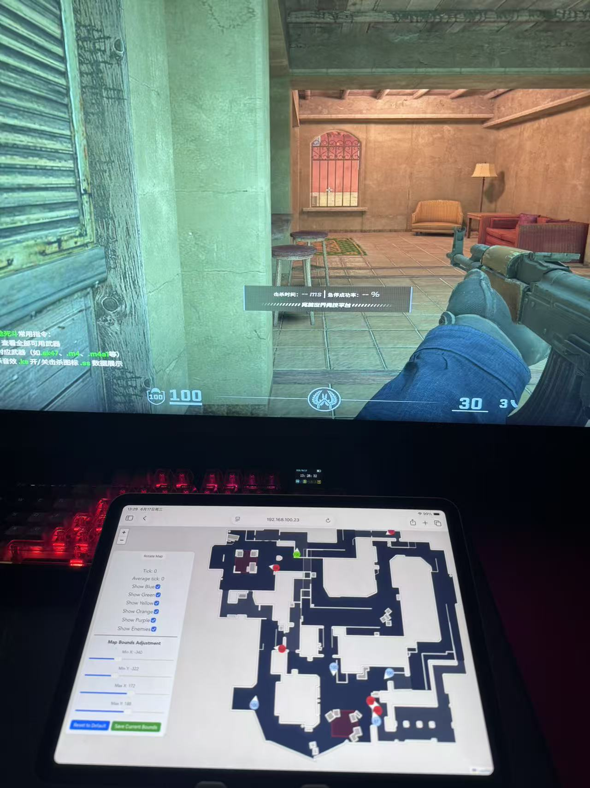

# cs2雷达	使用[memflow](https://github.com/memflow/memflow)
## 	作者 / 烟雨平生	UID : 421033640
 > ### 基于[cs2-dma-radar](https://github.com/rabume/cs2-dma-radar)
 > ### 使用AI重构为rust并使用memflow访问内存

### 视频教程	:	[CS2网页雷达使用memflow访问内存](https://www.bilibili.com/video/BV1JBj664E3Y)
### 文字教程	:	


## 1 : **安装memflow** 
```
sudo apt install cargo
cargo install memflowup

#root用户
sudo su

nano ~/.bashrc
export PATH=/home/??普通用户名/.cargo/bin:$PATH	#末尾添加后保存退出
source ~/.bashrc

memflowup pull --all	#安装到root用户
```


## 2 : **前端编译** 
```
sudo apt install npm

cd ??/cs2_memflow_radar/client

npm install --force
npm audit fix --force
npm run build
```


## 3 : **项目编译** 
```
cd ??/cs2_memflow_radar
cargo build --release

#VM里ssh连接运行
cd ??/cs2_memflow_radar
sudo ./target/release/cs2_radar -c qemu -o win32
```

### [无法找到 dtb](https://github.com/memflow/memflow/issues/100)	可更改为memflow-kvm连接器
### memflow-kvm连接器	:	待定




- 与之配套	[QEMU全仿真](https://github.com/sang-zi-dian-zhen/QEMU-virtual-machine-full-emulation-passes-pafish-testing)
  > 仓库属于	烟雨平生	UID : 421033640  
  > 桑梓店镇		UID : 1081527516  已测试2026-06-20\[5E平台]  


